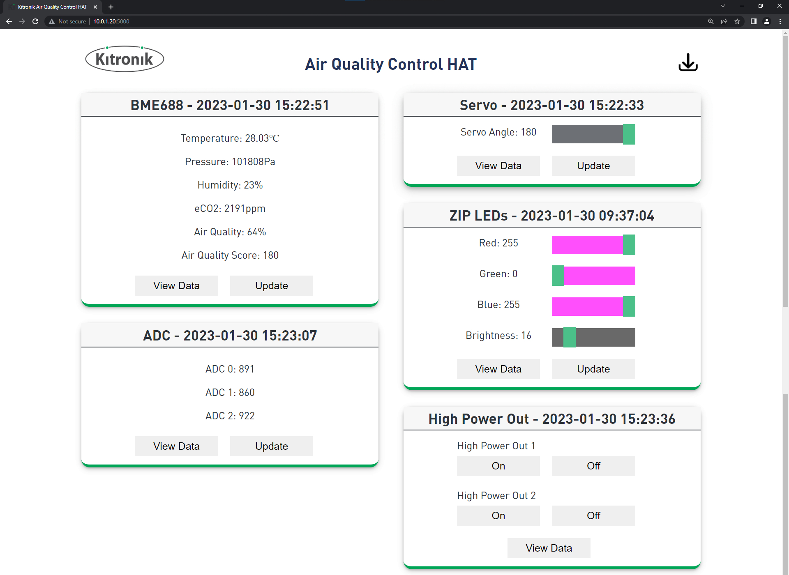

# Kitronik Air Quality Control HAT Dashboard
This repo contains a Flask web dashboard for the [Kitronik Air Quality Control HAT](https://www.kitronik.co.uk/5038).



<br/>

## Install the HAT Library
### Enable Serial Connection on the Raspberry Pi
We are going to enable serial0 from the Raspberry Pi to connect to the HAT. We need to edit the Raspberry Pi configuration by executing the following command:
```
sudo raspi-config
```

Inside of the configuration helper select the following options:
```
3 Interface Options
I6 Serial Port
Login shell over serial? No
Serial port hardware enabled? Yes
```

### Install the HAT package
To install the library package for the HAT run the following command on your Raspberry Pi in the terminal:
```
pip install KitronikAirQualityControlHAT
```
<br/>

## Setup the Flask web dashboard
### Install the Flask package
As the web dashboard uses Flask we are also going to install the Flask Python package. To do this run the following command on your Raspberry Pi in the terminal:
```
pip install Flask
```

### Clone this repo
For the Flask web dashboard we are going to need to copy the code inside this repo. Run the following commands on your Raspberry Pi in the terminal to clone the dashboard and move into that folder:
```
git clone https://www.github.com/KitronikLtd/Kitronik-Air-Quality-Control-HAT-Dashboard.git
cd Kitronik-Air-Quality-Control-HAT-Dashboard
```

### Initialise the database
With everything we need installed, we can now setup the database for our dashboard. We'll use the database to store data from the different sensors on our HAT. Run the following command in the terminal on your Raspberry Pi to initialise the database:
```
python init_db.py
```

### Start the dashboard
To start the web dashboard for our HAT we can run the `app.py` file. Run the following command on your Raspberry Pi in the terminal to start the HAT dashboard:
```
python app.py
```

The first time your run the dashboard app the BME688 sensor will need to calculate it's baseline values for the sensor. This could take a few minutes, but will only happen once.

<br/>

## Using the HAT dashboard
### Viewing Sensor Data
On the left hand side of the dashboard we can see the sensor data for the BME688 and the ADC connections.

To read the current values from either of these sensors we can click the `Update` buttons on the cards within the dashboard.

We can view all the data we have collected from these sensors using the `View Data` buttons on the cards.


### Controlling the Outputs
On the right hand side of the dashboard we can see the output control for the servo, ZIPLEDs and high power out connections.

To update the servo or ZIPLEDs we can move the sliders to the values we want and click the `Update` buttons on the cards.

To control the high power out connections we can click `On` and `Off` buttons under the high power out 1 or 2 connection.

We can also view the data we have collected from when these outputs have been changed using the `View Data` buttons on the cards.


